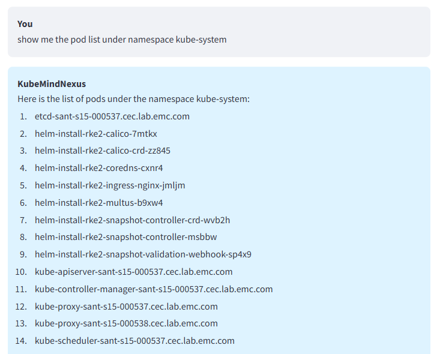
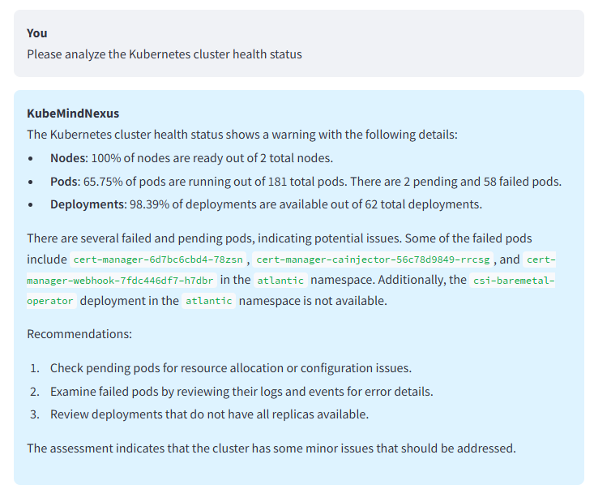
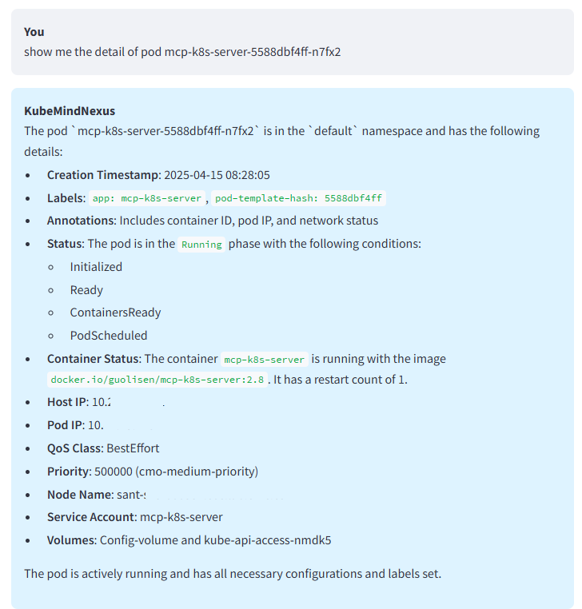

# MCP Kubernetes Server

A Kubernetes management MCP (Model Context Protocol) server that provides interfaces for getting information about Kubernetes clusters, performing operations, monitoring status, and analyzing resources.

## Features

- **Cluster Information**: Get detailed information about Kubernetes resources (pods, deployments, services, etc.)
- **Cluster Operations**: Perform operations on Kubernetes resources (create, update, delete, scale, etc.)
- **Monitoring**: Monitor the status of Kubernetes clusters and resources
- **Analysis**: Analyze Kubernetes resources and provide recommendations
- **Prompts**: Includes prompts for common Kubernetes analysis tasks

## Examples
### Ex.1


### Ex.2


### Ex.3


## Installation

### From Source

```bash
git clone https://github.com/yourusername/mcp-k8s-server.git
cd mcp-k8s-server
pip install -e .
```

### Using pip

```bash
pip install mcp-k8s-server
```

## Usage

### Running Directly

```bash
# Run with default settings
mcp-k8s-server

# Specify transport type
mcp-k8s-server --transport sse

# Specify port for SSE transport
mcp-k8s-server --port 8000

# Specify config file
mcp-k8s-server --config /path/to/config.yaml
```

### Using Docker

The Dockerfile uses the command and args pattern to run the server:

```dockerfile
CMD ["python", "-m", "mcp_k8s_server.main", \
     "--transport", "sse", \
     "--port", "8000", \
     "--host", "0.0.0.0", \
     "--config", "/etc/rancher/rke2/rke2.yaml", \
     "--debug"]
```

To build and run the Docker container:

```bash
# Build the Docker image
docker build -t mcp-k8s-server .

# Run the Docker container
docker run -p 8000:8000 -v ~/.kube:/home/mcp/.kube mcp-k8s-server
```

Alternatively, you can use the provided script:

```bash
# Make the script executable
chmod +x docker-run.sh

# Run the script
./docker-run.sh
```

This script builds the Docker image and runs the container with the necessary volume mounts.

### Deploying to Kubernetes

```bash
# Apply the Kubernetes manifests
kubectl apply -f k8s/
```

When deploying to Kubernetes, the server will automatically use the in-cluster configuration. The Kubernetes manifests in the `k8s/` directory are set up to:

1. Create a ServiceAccount with appropriate permissions
2. Mount the service account token and certificate
3. Configure the server with command-line arguments

You can customize the deployment by editing the manifests:

```yaml
# k8s/deployment.yaml (example)
apiVersion: apps/v1
kind: Deployment
metadata:
  name: mcp-k8s-server
  # ...
spec:
  # ...
  template:
    # ...
    spec:
      serviceAccountName: mcp-k8s-server  # Uses the ServiceAccount defined in rbac.yaml
      containers:
      - name: mcp-k8s-server
        # ...
        command:
        - python
        - -m
        - mcp_k8s_server.main
        args:
        - --transport
        - sse
        - --port
        - "8000"
        - --host
        - "0.0.0.0"
        - --config
        - "/app/config/config.yaml"
        - --debug
```

This approach uses the command and args pattern to configure the server, which is a common pattern in Kubernetes. The command specifies the executable to run, and the args specify the command-line arguments to pass to the executable.

The `KUBERNETES_SERVICE_HOST` and `KUBERNETES_SERVICE_PORT` environment variables are automatically set by Kubernetes when the pod is created, so you don't need to specify them in your deployment manifest.

## Configuration

The server can be configured using a YAML configuration file, environment variables, or command-line arguments.

### In-Cluster Configuration

When running inside a Kubernetes cluster, the server automatically uses the in-cluster configuration. This relies on the following:

1. Environment variables:
   - `KUBERNETES_SERVICE_HOST`: Set by Kubernetes to the IP address of the Kubernetes API server
   - `KUBERNETES_SERVICE_PORT`: Set by Kubernetes to the port of the Kubernetes API server

2. Service account token and certificate:
   - `/var/run/secrets/kubernetes.io/serviceaccount/token`: Service account token
   - `/var/run/secrets/kubernetes.io/serviceaccount/ca.crt`: CA certificate

These are automatically set by Kubernetes when running in a pod. If you're running the server outside a Kubernetes cluster but want to test the in-cluster configuration, you would need to manually set these environment variables and create the token and certificate files.

When running outside a cluster, the server falls back to using the kubeconfig file.

### Testing In-Cluster Configuration Locally

If you want to test the in-cluster configuration locally (outside a Kubernetes cluster), you can manually set up the required environment variables and files:

1. Set the environment variables:
   ```bash
   export KUBERNETES_SERVICE_HOST=<kubernetes-api-server-ip>
   export KUBERNETES_SERVICE_PORT=<kubernetes-api-server-port>
   ```
   
   You can get these values by running:
   ```bash
   kubectl cluster-info
   ```

2. Create the service account token and certificate directories:
   ```bash
   mkdir -p /var/run/secrets/kubernetes.io/serviceaccount/
   ```

3. Copy your Kubernetes certificate and create a token:
   ```bash
   # Copy the CA certificate
   kubectl config view --raw -o jsonpath='{.clusters[0].cluster.certificate-authority-data}' | base64 -d > /var/run/secrets/kubernetes.io/serviceaccount/ca.crt
   
   # Create a token file (you can use a service account token or generate a temporary one)
   echo "your-service-account-token" > /var/run/secrets/kubernetes.io/serviceaccount/token
   ```

Note that this approach requires root privileges to create files in `/var/run/secrets/`. Alternatively, you can modify the code to use different paths for testing purposes.

### Configuration File

```yaml
# config.yaml
server:
  name: mcp-k8s-server
  transport: both  # stdio, sse, or both
  port: 8000
  host: 0.0.0.0

kubernetes:
  config_path: ~/.kube/config
  context: default
  namespace: default
```

## MCP Resources

The server provides access to Kubernetes resources through the Model Context Protocol (MCP). Resources are identified by URI patterns following the `k8s://` protocol.

### Resource URI Patterns

Resources are organized in a hierarchical structure:

- `k8s://resources` - List of all available Kubernetes resources
- `k8s://namespaces` - List of all Kubernetes namespaces
- `k8s:///{namespace}` - Overview of all resources in a namespace

#### Namespaced Resources

- `k8s://{namespace}/{resource_type}` - List resources of a specific type in a namespace
  - Example: `k8s://default/pods` - All pods in the 'default' namespace
  
- `k8s://{namespace}/{resource_type}/{name}` - Get a specific namespaced resource
  - Example: `k8s://default/deployments/nginx` - The 'nginx' deployment in the 'default' namespace

Supported resource types:
- `pods`
- `deployments`
- `services`
- `persistentvolumeclaims`
- `events`

#### Cluster-Scoped Resources

- `k8s:///{resource_type}` - List cluster-scoped resources of a specific type
  - Example: `k8s:///nodes` - All nodes in the cluster
  
- `k8s:///{resource_type}/{name}` - Get a specific cluster-scoped resource
  - Example: `k8s:///nodes/worker-1` - The 'worker-1' node

Supported resource types:
- `nodes`
- `persistentvolumes`
- `namespaces`

## MCP Tools

The server provides the following MCP tools:

### Resource Information

- `get_resources`: Get a list of resources of a specific type
- `get_resource`: Get detailed information about a specific resource
- `get_resource_status`: Get the status of a specific resource
- `get_resource_events`: Get events related to a specific resource
- `get_resource_logs`: Get logs for a specific resource

### Resource Operations

- `create_resource`: Create a new resource
- `update_resource`: Update an existing resource
- `delete_resource`: Delete a resource
- `scale_deployment`: Scale a deployment
- `restart_deployment`: Restart a deployment
- `execute_command`: Execute a command in a pod

### Monitoring

- `get_cluster_status`: Get the overall status of the cluster
- `get_node_status`: Get the status of cluster nodes
- `get_resource_metrics`: Get metrics for a specific resource
- `get_cluster_metrics`: Get metrics for the entire cluster
- `check_cluster_health`: Perform a comprehensive health check of the cluster and get a detailed summary

## License

MIT
